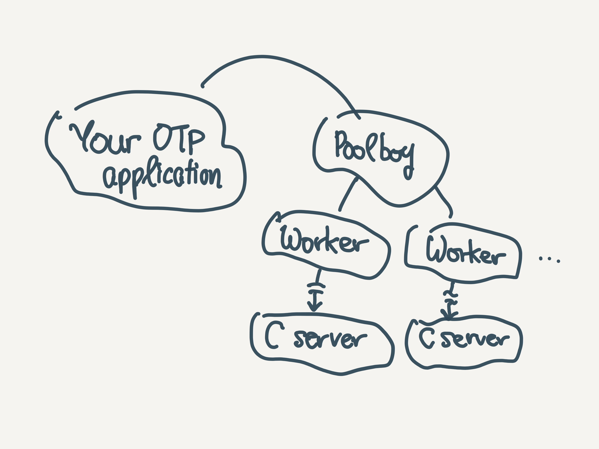

# Supervised Scaler

The Supervised Scaler is an Elixir/Phoenix project made to support [my lightning talk](https://www.icloud.com/keynote/0-4TNF2RqhabO9t6GIfgV3djw) at [Elixir London 2016](http://www.elixir.london). It is laid out thusly:

1.  A simple Phoenix application, `scaler`, which generates thumbnails using a local dependency.
2.  The local dependency, `resampler` which contains an Elixir wrapper around a C server, which calls libVIPS.

## High Level Structure

## How to run the app

1.  Get a proper version of Erlang/OTP
2.  Get a proper version of Elixir, I’ve used 1.3.2 via kiex
3.  Make sure you have some sort of compiler in place
4.  Make sure you have libVIPS in place and `pkg-config` reports it properly. See: `pkg-config --libs --cflags vips`.
5.  Run the application.

## How to transplant this library to your app

1.  Grab the local dependency `resampler` from `deps_local`. (Note: once we have a proper entry in the package manager this will change.)
2.  Make sure you have `Resampler.Pool` as part of your application’s supervision tree.
3.  Use the library as usual: ``{:ok, file_path} = Resampler.request(path, maxWidth, maxHeight)`.

## Help needed?

Open an Issue and I’ll look at them whenever I can.

## Help wanted

1.  Sort out STDERR / STDOUT separation in erlexec vs. PTY vs. fgets. See [issue in erlexec](https://github.com/saleyn/erlexec/issues/41).
2.  Proper dependency extraction, packaging and publication to make this into a real dependency worthy of a place in your `mix.exs`
3.  A more comprehensive performance benchmarking to understand what sort of overhead is incurred by the current solution.
4.  Once #2 is done, a more proper documentation scheme to be put in place.
5.  Embed a nonce in each request.
6.  Additional promotion.

## References

* [Elixir Native Interoperability – Ports vs. NIFs](https://spin.atomicobject.com/2015/03/16/elixir-native-interoperability-ports-vs-nifs/)
* [erlexec](https://github.com/saleyn/erlexec)
* [exexec](https://github.com/antipax/exexec)
* [poolboy](https://github.com/devinus/poolboy)
